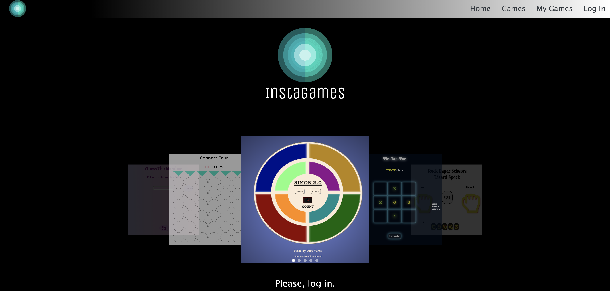
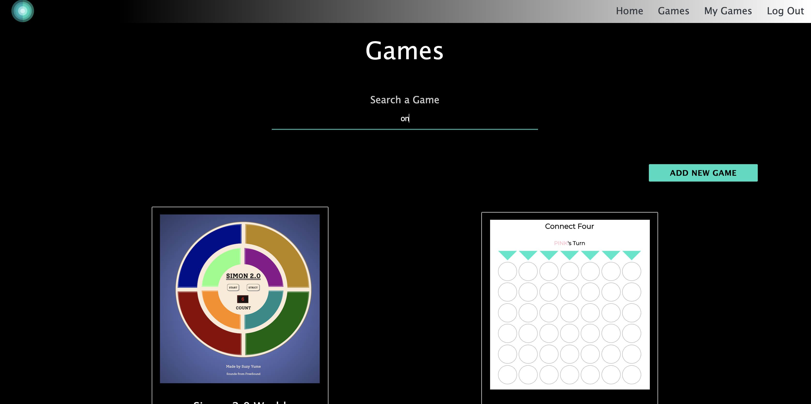
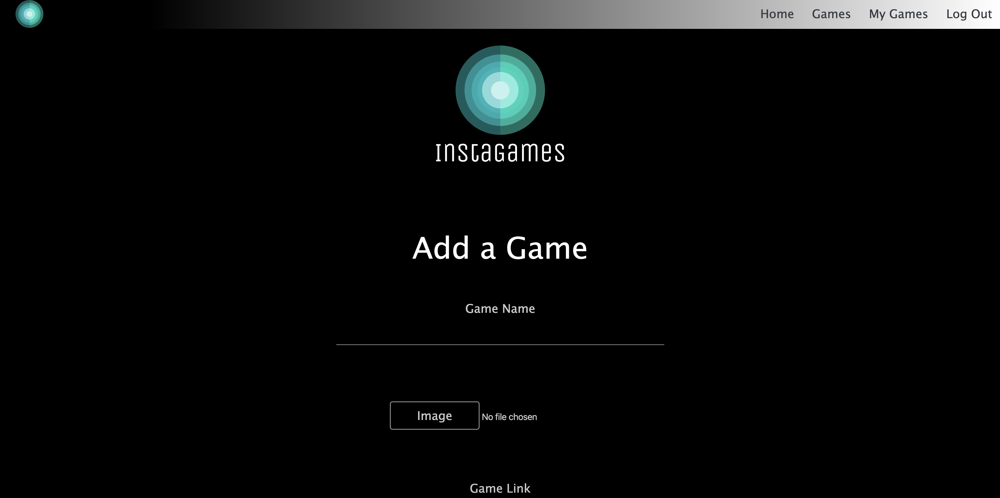
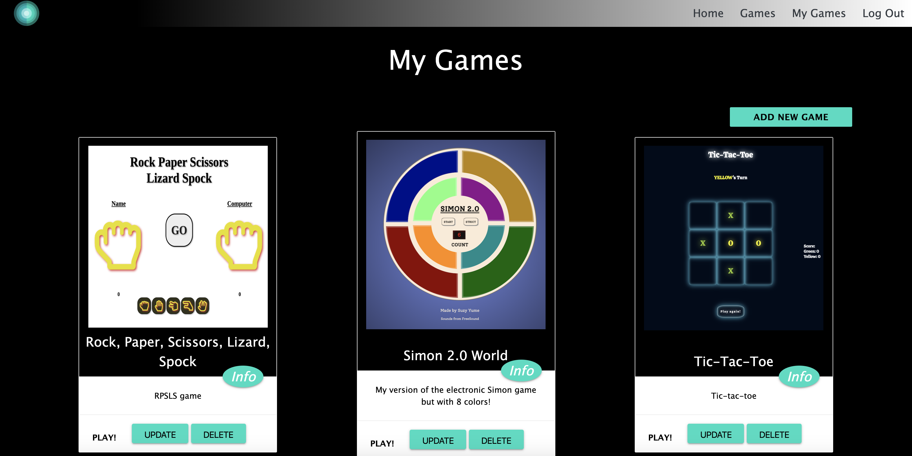

# Instagames

Full-stack CRUD application where the user(developers) can add their games, comment on each other games, play th games and check out their code.

And app where a developer can, not only get some reviews on their code, but can also learn from other people's code!

---

# Screenshots

---

# Technologies Used

Node.js, ExpressJs, MongoDb, Mongoose

---

# Getting Started

Check the App [here](https://www.example.com)

Check the Trello board [here](https://trello.com/b/XYitKOk0/ga-project-2-games-page)

Check the Heroku link [here](https://www.example.com)

    Instructions:
        1. Enter the site above
        2. Sign In
        3. Add your games or check other people games and codes
        4. Enjoy!

---

# Next Steps

Fetch the added/deleted comments with ajax.
